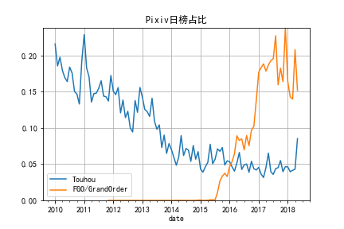

# data_analysis

Some data analysis code about Pixiv.net daily ranking data.

Just so you know.

## Overview

### data

Some data files.

### data_img

Some pictures of the processed data.

### pixiv_daily_rank.ipynb

从json文件中加载数据，获取某月标签数的前20位，绘图。

### pixiv_daily_rank_2.ipynb

从json文件中加载2010-2018年的所有基本数据与标签数据时，内存不足，耗时过长，且不能成功。

故先分块将json文件中需要的数据转化为csv文件，减少直接从json文件中导出所消耗的资源。

### pixiv_daily_rank_3.ipynb

从csv文件中加载数据，绘制Pixiv日榜占比图。

## Update Records

### 2018-9-12

#### Add two data files (csv -> 7z)

尝试从原json文件中加载数据发现，消耗内存过多，无法实现。

后尝试分批从json文件中将有用信息取出，按年份保存为csv文件。

最后将所有保存好的csv文件读入，pd.concat成一整个DataFrame，然后使用to_csv方法，保存为一整个csv文件。

至此，读入写出均不会占用过大内存，个人认为之前在解析json文件时，占用了太多内存，导入读入失败。（待验证）

#### Add data img

制作了一张2010-01-01到2018-05-05的Pixiv日榜特定标签占比图
